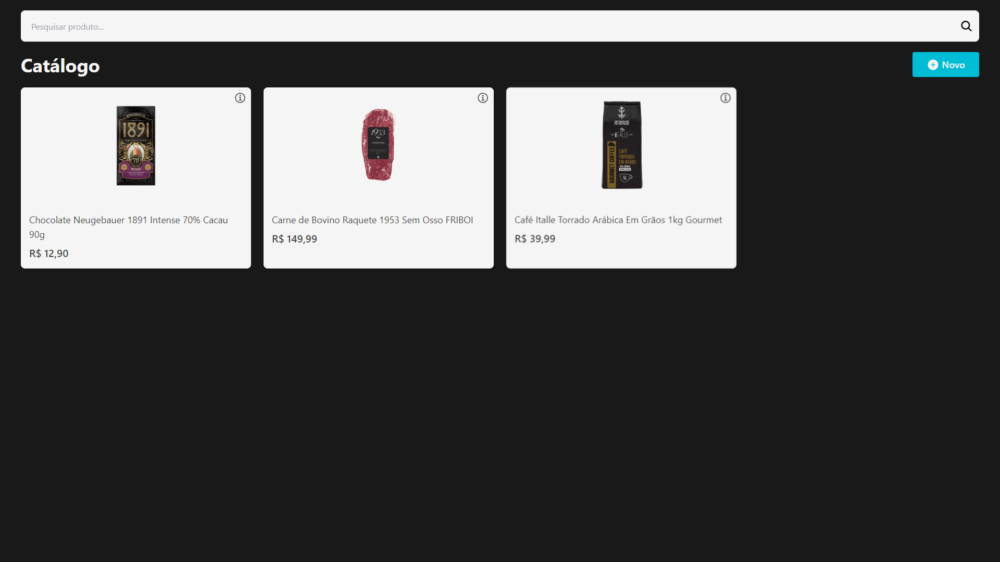

# Digital Catalog

<div align="center">

[](https://opensource.org/licenses/MIT)
[](https://www.typescriptlang.org/)
[]()
[]()

[](https://react.dev/)
[](https://www.typescriptlang.org/)
[](https://tailwindcss.com/)
[](https://react-icons.github.io/react-icons/)
[](https://prettier.io/)
[](https://eslint.org/)
[](https://vitejs.dev/)

</div>

## Sobre

O **Digital Catalog** é uma solução inovadora projetada para digitalizar a divulgação de produtos, substituindo os tradicionais folhetos impressos por uma alternativa sustentável e acessível. Focado em pequenos comerciantes locais, como mercadinhos e bodegas, especialmente na região metropolitana de Fortaleza, este catálogo digital oferece uma forma moderna e eficiente de apresentar produtos e promoções aos clientes.

<h4>Benefícios</h4>

- **Para os Comerciantes:** Redução dos custos com materiais impressos, agilidade na atualização de preços e promoções, e fortalecimento do marketing local.

- **Para os Clientes:** Acesso prático e conveniente às ofertas, com a facilidade de visualizar produtos diretamente no seu dispositivo, a qualquer momento.


<h4>Impacto Ambiental</h4>

Ao digitalizar a divulgação de produtos, contribuímos para a preservação do meio ambiente, eliminando a necessidade de impressões em papel. Esta iniciativa está alinhada com os Objetivos de Desenvolvimento Sustentável (ODS), em especial o **ODS 12: Produção e Consumo Responsáveis**, incentivando práticas mais conscientes e sustentáveis tanto para comerciantes quanto para consumidores.

[]()

## Guia de Instalação

<h4>1. Clonagem do Repositório</h4>

```bash
git clone https://github.com/marllonmendez/digital-catalog.git
```

<h4>2. Instalação de Dependências</h4>

```bash
npm install
```

<h4>4. Execução Local</h4>

```bash
npm run dev
```

## Informações
Este projeto foi desenvolvido na nuvem por meio da ferramenta [Replit](https://replit.com).


## Licença

Este projeto está licenciado sob a [Licença MIT](LICENSE).
